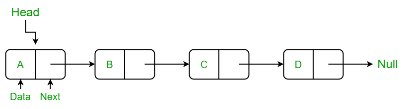

<link rel="stylesheet" href="notes.css">

# NOTES

## Contents

- [NOTES](#notes)
  - [Contents](#contents)
  - [UNIT - 1](#unit---1)
    - [Memory Allocation](#memory-allocation)
      - [Static Memory Allocation](#static-memory-allocation)
      - [Dynamic Memory Allocation](#dynamic-memory-allocation)
    - [Linked List](#linked-list)
      - [Singly Linked List](#singly-linked-list)
      - [Doubly Linked List](#doubly-linked-list)
      - [Circular Singly Linked List](#circular-singly-linked-list)
      - [Circular Doubly Linked List](#circular-doubly-linked-list)
      - [Multi List](#multi-list)
      - [Skip List](#skip-list)
    - [STACKS](#stacks)
      - [Array implementation](#array-implementation)
      - [LL implementation](#ll-implementation)
      - [Structure implementation](#structure-implementation)

---

## UNIT - 1

### Memory Allocation

#### Static Memory Allocation

- Exact size and type of memory must be known at compile time
- Exact size and type of memory must be known at compile time
- Memory is allocated in stack area

```c
int b;
int c[10] ;
```

- Disadvantages

  - Memory allocated can not be altered during run time as it
    is allocated during compile time
  - This may lead to under utilization or over utilization of
    memory
  - Memory can not be deleted explicitly only contents can
    be overwritten
  - Useful only when data size is fixed and known before
    processing

#### Dynamic Memory Allocation

- Dynamic memory allocation is used to obtain and
  release memory during program execution.
- It operates at a low-level
- Memory Management functions are used for allocating
  and deallocating memory during execution of program
- These functions are defined in “stdlib.h”
- Dynamic Memory Allocation Functions:
  - Allocate memory - malloc(), calloc(), and realloc()
  - Free memory - free()

```c
int *p;
if ((p = (int*)malloc(100 * sizeof(int))) == NULL){
  printf("out of memory\n");
  exit();
}
int *ptr;
ptr=(int*)calloc(100,sizeof(int));
```

### Linked List

#### Singly Linked List

```c
// Structure to represent a node
struct node {
    int data;
    struct node *link;
};
typedef struct node NODE;

// Structure to represent a linked list
struct list {
    NODE *head;
};
typedef struct list LIST;

```



```c
// Initialize the list with an empty head
void init_list(LIST *ptr_list) {
    ptr_list->head = NULL;
}
```

- Insertion

```c
// Insert node at the head of the list
void insert_head(LIST *ptr_list, int data) {
    NODE *temp = (NODE *)malloc(sizeof(NODE));
    temp->data = data;
    temp->link = ptr_list->head;
    ptr_list->head = temp;
}

// Insert node at the end of the list
void insert_end(LIST *ptr_list, int data) {
    NODE *pres = ptr_list->head;
    NODE *temp = (NODE *)malloc(sizeof(NODE));
    temp->data = data;
    temp->link = NULL;

    if (pres == NULL) {
        ptr_list->head = temp;
    } else {
        while (pres->link != NULL)
            pres = pres->link;
        pres->link = temp;
    }
}

// Insert node at a specific position in the list
void insert_pos(LIST *ptr_list, int data, int pos) {
    NODE *pres = ptr_list->head, *temp;
    int i = 1;
    temp = (NODE *)malloc(sizeof(NODE));
    temp->data = data;
    temp->link = NULL;

    if (pos == 1) {
        temp->link = ptr_list->head;
        ptr_list->head = temp;
        return;
    }

    while (pres != NULL && i < pos - 1) {
        pres = pres->link;
        i++;
    }

    if (pres != NULL) {
        temp->link = pres->link;
        pres->link = temp;
    } else {
        printf("\nInvalid position.\n");
    }
}
```

- Display

```c
// Display the list
void display(LIST *ptr_list) {
    NODE *pres = ptr_list->head;
    if (pres == NULL) {
        printf("\nEmpty list.\n");
    } else {
        while (pres != NULL) {
            printf("%d --> ", pres->data);
            pres = pres->link;
        }
    }
}
```

- Deletion

```c
// Delete node by value
void delete_node(LIST *ptr_list, int data) {
    NODE *pres = ptr_list->head, *prev = NULL;

    while (pres != NULL && pres->data != data) {
        prev = pres;
        pres = pres->link;
    }

    if (pres != NULL) {
        if (prev == NULL) {
            ptr_list->head = pres->link;
        } else {
            prev->link = pres->link;
        }
        free(pres);
    } else {
        printf("Node not found..\n");
    }
}

// Delete node at a specific position
void delete_pos(LIST *ptr_list, int pos) {
    NODE *pres = ptr_list->head, *prev = NULL;
    int i = 1;

    while (pres != NULL && i < pos) {
        prev = pres;
        pres = pres->link;
        i++;
    }

    if (pres != NULL) {
        if (prev == NULL) {
            ptr_list->head = pres->link;
        } else {
            prev->link = pres->link;
        }
        free(pres);
    } else {
        printf("Invalid Position..\n");
    }
}

// Delete alternate nodes
void delete_alternate(LIST *ptr_list) {
    NODE *pres = ptr_list->head, *prev = NULL;

    while (pres != NULL) {
        if (prev == NULL) {
            ptr_list->head = pres->link;
        } else {
            prev->link = pres->link;
        }
        prev = pres->link;
        if (prev != NULL)
            pres = prev->link;
        else
            pres = NULL;
    }
}
```

#### Doubly Linked List

```c
struct node
{
    int key;       // Data (value) of the node
    struct node *next;  // Pointer to the next node
    struct node *prev;  // Pointer to the previous node
};

typedef struct node NODE;

struct dlist
{
    NODE *head;     // Pointer to the head node
                    // (first node of the list)
};

typedef struct dlist DLIST;
```


```c
void init_list(DLIST *ptr_list)
{
    // Initialize the list with an empty head
    ptr_list->head = NULL;
}
```

- Insertion

```c
void insert_head(DLIST *ptr_list, int key)
{
    // Allocate memory for a new node
    NODE *temp = (NODE *)malloc(sizeof(NODE));
    temp->key = key;
    temp->next = temp->prev = NULL;

    if (ptr_list->head == NULL)
        // If the list is empty, make temp the head
        ptr_list->head = temp;
    else
    {
        temp->next = ptr_list->head;
         // Point new node to current head
        ptr_list->head->prev = temp;
        // Point current head's prev to new node
        ptr_list->head = temp;  // Update the head to the new node
    }
}
void insert_tail(DLIST *ptr_list, int key)
{
    NODE *temp, *pres;
    // Allocate memory for a new node
    temp = (NODE *)malloc(sizeof(NODE));
    temp->key = key;
    temp->next = temp->prev = NULL;

    if (ptr_list->head == NULL)
      // If the list is empty, make temp the head
      ptr_list->head = temp;
    else
    {
      pres = ptr_list->head;
      // Traverse to the last node
      while (pres->next != NULL)
          pres = pres->next;

      // Make the last node point to the new node
      pres->next = temp;
      // Make the new node's prev point to the last node
      temp->prev = pres;
    }
}
```

- Display

```c
void display(DLIST *ptr_list)
{
    NODE *pres = ptr_list->head;  // Start from the head

    if (pres == NULL)
        printf("\nEmpty List..\n");
    else
    {
        while (pres != NULL)
        {
            printf("%d<->", pres->key);  // Print the key
            pres = pres->next;  // Move to the next node
        }
    }
    printf("\n");
}
```

- Deletion

```c
void delete_first(DLIST *ptr_list)
{
  NODE *pres = ptr_list->head;

  if (pres->next == NULL)
    // Only one node, set head to NULL
    ptr_list->head = NULL;
  else
  {
    // Make the second node's prev NULL
    pres->next->prev = NULL;
    // Update the head to the second node
    ptr_list->head = pres->next;
  }
  free(pres);  // Free the memory of the deleted node
}
void delete_last(DLIST *ptr_list)
{
    NODE *pres = ptr_list->head;

    if (pres->next == NULL)  // Only one node
        ptr_list->head = NULL;
    else
    {
        while (pres->next != NULL)  // Traverse to the last node
            pres = pres->next;

        // Make the second-to-last node's next NULL
        pres->prev->next = NULL;
    }
    free(pres);  // Free the memory of the last node
}
```

> If You want **explaination** for these code maybe stop cs engg and become prompt engg and <span class="highlight">**ASK GPT**</span>

#### Circular Singly Linked List

```c
struct node
{
    int data;
    struct node *link;
};

typedef struct node NODE;

struct list
{
    NODE *last;
};

typedef struct list CLIST;
```


```c
void init_list(CLIST *ptr_list)
{
    ptr_list->last = NULL;
}
```

- Insertion

```c
void insert_front(CLIST *ptr_list, int data)
{
    NODE *temp, *p;

    // Create a new node
    temp = (NODE*)malloc(sizeof(NODE));
    temp->data = data;
    temp->link = temp;  // Links to itself (circular)

    p = ptr_list->last;  // Get the address of the last node

    if(p == NULL)  // First node (empty list)
        ptr_list->last = temp;
    else
    {
        temp->link = p->link;
        p->link = temp;
    }
}
void insert_end(CLIST *ptr_list, int data)
{
    NODE *temp, *p;

    // Create a new node
    temp = (NODE*)malloc(sizeof(NODE));
    temp->data = data;
    temp->link = temp;  // Links to itself (circular)

    p = ptr_list->last;  // Get the address of the last node

    if(p == NULL)  // Empty list
        ptr_list->last = temp;  // First node
    else
    {
        temp->link = p->link;  // Link after the last node
        p->link = temp;
        ptr_list->last = temp;  // Update the last pointer
    }
}
```

- Display

```c
void display(CLIST* ptr_list)
{
    NODE *pres, *end;

    if(ptr_list->last == NULL)
        printf("Empty List\n");
    else
    {
        end = ptr_list->last;  // Copy last node's address
        pres = end->link;  // Point to the first node

        while(pres != end)
        {
            printf("%d ->", pres->data);
            pres = pres->link;
        }
        printf("%d ", pres->data);  // Print the last node
    }
}
```

- Deletion

```c
void delete_node(CLIST* ptr_list, int data)
{
    NODE *end, *pres, *prev;
    end = ptr_list->last;  // Copy address of the last node
    pres = end->link;  // Point to the first node
    prev = end;

    // Find the node with the given data
    while((pres->data != data) && (pres != end))
    {
        prev = pres;
        pres = pres->link;
    }

    if(pres->data == data)
    {
        // If only one node
        if(pres->link == pres)
            ptr_list->last = NULL;
        else
        {
            // Link the previous node to the next node
            prev->link = pres->link;
            if(pres == end)  // If deleting the last node
                ptr_list->last = prev;  // Update the last pointer
        }
        free(pres);
    }
    else
        printf("Data not found..\n");
}
```

#### Circular Doubly Linked List

```c
struct node {
    int data;
    struct node *next;
    struct node *prev;
};

typedef struct node NODE;

struct list {
    NODE *head;
};
```


```c
void init_list(CDLL *ptr_list) {
    ptr_list->head = NULL;
}
```

- Insertion

```c
void insert_front(CDLL *ptr_list, int data) {
    NODE *temp;

    // Create new node
    temp = (NODE *)malloc(sizeof(NODE));
    temp->data = data;

    if (ptr_list->head == NULL) {  // If the list is empty
        temp->next = temp;  // Points to itself
        temp->prev = temp;  // Points to itself
        ptr_list->head = temp;  // Head points to the new node
    } else {
        // Next node points to current head
        temp->next = ptr_list->head;
        // Previous node points to current last
        temp->prev = ptr_list->head->prev;
        // Last node's next points to the new node
        ptr_list->head->prev->next = temp;
        // Head's previous points to the new node
        ptr_list->head->prev = temp;
        // Make new node as head
        ptr_list->head = temp;
    }
}
void insert_end(CDLL *ptr_list, int data) {
    NODE *temp;

    // Create new node
    temp = (NODE *)malloc(sizeof(NODE));
    temp->data = data;

    if (ptr_list->head == NULL) {  // If the list is empty
        temp->next = temp;  // Points to itself
        temp->prev = temp;  // Points to itself
        ptr_list->head = temp;  // Head points to the new node
    } else {
        // Next points to the head
        temp->next = ptr_list->head;
        // Previous points to the current last node
        temp->prev = ptr_list->head->prev;
        // Last node's next points to the new node
        ptr_list->head->prev->next = temp;
        // Head's previous points to the new node
        ptr_list->head->prev = temp;
    }
}
```

- Display

```c
void display(CDLL *ptr_list) {
    NODE *pres;

    if (ptr_list->head == NULL) {
        printf("Empty List\n");
    } else {
        pres = ptr_list->head;

        // Traverse the list in forward direction
        do {
            printf("%d <-> ", pres->data);
            pres = pres->next;
        } while (pres != ptr_list->head);
        // Stop when we circle back to head

        printf("(Head)\n");
    }
}
```

- Deletion

```c
void delete_node(CDLL *ptr_list, int data) {
    NODE *temp, *pres;

    if (ptr_list->head == NULL) {
        printf("List is empty\n");
        return;
    }

    pres = ptr_list->head;

    // Traverse the list to find the node
    do {
        if (pres->data == data) {
            temp = pres;

            if (pres->next == pres) {  // If there's only one node
              ptr_list->head = NULL;  // List becomes empty
            } else {
              // Previous node's next points to the next node
              pres->prev->next = pres->next;
              // Next node's previous points to the previous node
              pres->next->prev = pres->prev;
              if (pres == ptr_list->head) {
                // If head is to be deleted, update head
                 ptr_list->head = pres->next;
              }
            }

            free(temp);
            printf("Node with data %d deleted\n", data);
            return;
        }
        pres = pres->next;
    } while (pres != ptr_list->head);
    // Stop when we circle back to head
    printf("Data not found\n");
}
```

#### Multi List

- OK So multi list(Sparse list) is basically a 2D List of a matrix
- The main point being we just dont include 0s' in the list at all
- There are two Nodes for this list
  

  $$
  \begin{bmatrix}
  2 & 0 & 0 &0 \\
  4 & 0 & 0 & 3 \\
  0 & 0 & 0 & 0 \\
  8 & 0 & 0 & 1 \\
  0 & 0 & 6 & 0
  \end{bmatrix}
  $$

  

- You can imagine what functions we have with these , no implementation so less work for me

#### Skip List

- This is basically a list where we keep multiple copies with some missing elements who are attached to each other


- Skip Lists support O(log n)

  - Insertion
  - Deletion
  - Search

- Ok SO lets say we wanna go to 60 how do we go
- Some basic rule would look like
  - x = y: we return element(after(p))
  - x > y: we “scan forward”
  - x < y: we “drop down”
    
- For Insertion We use a random function to tell us inside how many rows should the element be in
- For deletion we delete all the appearing node of that data and if there are more than one empty row then we delete the extras

### STACKS

- Definition: A stack is a linear data structure that follows the Last In, First Out (LIFO) principle, meaning the last element added is the first to be removed.

- Basic Operations:
  - Push: Adds an element to the top of the stack.
  - Pop: Removes the top element from the stack.
  - isEmpty: Checks if the stack is empty.


- Implementation:

  - Can be implemented using arrays or linked lists.
  - In an array-based stack, a fixed size is predefined.
  - In a linked-list-based stack, dynamic memory allocation is used.

- Applications:

  - Expression evaluation: Infix to postfix conversion, postfix evaluation.
  - Backtracking: Undo operations in text editors, solving mazes.
  - Function call management: Recursion uses stack memory.
  - Browser navigation: Forward and backward navigation.

- Complexity:

  - Push, Pop, and Peek operations are performed in O(1) time.

- Limitations:

  - Fixed size in array-based stacks can lead to stack overflow.
  - Linked-list-based stacks require additional memory for pointers.

#### Array implementation

> There is no need of structure in array implementation COS we use a <span class="highlight">**FUCKING ARRAY**</span>

- Push Function

```c
int push(int *s, int *top, int size, int ele)
{
    if (*top == size - 1) // Check for stack overflow
    {
        printf("STACK IS OVERFLOWING\n");
        return 0;
    }
    *top = *top + 1; // Increment top
    s[*top] = ele;   // Insert element at the new top position
    return 1;        // Return success
}
```

- Pop Function

```c
int pop(int *s, int *top, int size)
{
    if (*top == -1) // Check for stack underflow
    {
        printf("Stack is underflow\n");
        return 0;
    }
    int ele = s[*top]; // Store the top element to return later
    *top = *top - 1;   // Decrement top
    return ele;        // Return the popped element
}
```

- Display Function

```c
void display(int *s, int top, int size)
{
    if (top == -1) // Check if the stack is empty
    {
        printf("Stack is empty\n");
    }
    else
    {
        printf("Stack elements are:\n");
        // Traverse from top to bottom
        for (int i = top; i >= 0; i--)
        {
            printf("%d ", s[i]);
        }
        printf("\n");
    }
}
```

> If Any of these Functions Confuse you <span class="highlight">_YOU ARE COOKED_</span>

#### LL implementation

- FOR Linked list implementation guess what we use <span class=highlight>FUCKING LINKED LIST</span>
<figure>
<figcaption>
IKR FUCKING MIND BOGGLING
</figcaption>
</figure>

```c
// Node structure for each stack element
typedef struct node
{
    int data;           // Data part of the node
    struct node *link;  // Pointer to the next node
} NODE;

// Stack structure with a pointer to the top node
typedef struct stack
{
    NODE *top;          // Pointer to the top of the stack
} STACK;
```

Anyways here's the code for the functions,you might but `WIZ` Where is the main function , To that i say **_fuck you_** make your own

- INIT

```c
// Initialize the stack by setting the top to NULL
void init(STACK *ptr)
{
    ptr->top = NULL;
}
```

> If you are wondering why do all this ,why extra init function?<br/>
> WELL <br/>

- What if you have more than one stack or you don'y know how many you have yet
  <br/>- Thats why we do this

- PUSH

```c
// Push an element onto the stack
void push(STACK *ptr, int ele)
{
    // Create and populate a new node
    NODE *temp = (NODE *)malloc(sizeof(NODE));
    temp->data = ele;   // Set the data part
    temp->link = NULL;  // Initialize the link to NULL

    // Insert the new node at the top of the stack
    temp->link = ptr->top; // Point new node to the current top
    ptr->top = temp;       // Update top to the new node
}
```

- POP

```c
// Pop the top element from the stack
int pop(STACK *ptr)
{
    NODE *p;
    int data;

    p = ptr->top;       // Point to the current top
    if (p == NULL)      // Check for empty stack
    {
        printf("Empty stack\n");
        return 0;
    }

    // Retrieve and remove the top element
    data = p->data;         // Get the data from the top node
    ptr->top = p->link;     // Update top to the next node
    free(p);                // Free the memory of the removed node
    return data;            // Return the popped data
}
```

- DISPLAY

```c
// Display all elements in the stack
void display(STACK *ptr)
{
    NODE *p = ptr->top;  // Start from the top of the stack

    if (p == NULL)       // Check if the stack is empty
    {
        printf("Empty stack\n");
    }
    else
    {
        // Traverse the stack and print elements
        while (p != NULL)
        {
            // Print current node's data
            printf("%d --> ", p->data);
            p = p->link;    // Move to the next node
        }
        printf("NULL\n");              // End of stack
    }
}
```

```bash
Output :
10 --> 11 --> NULL
```

#### Structure implementation

- OK , Remember how we made array implementation
- But what if we need more than one and can't hardcode the number of stacks
- That's when we use Structure implementation

```c
// Define a structure for stack
typedef struct stack
{
  int *s;     // Pointer to the array holding stack elements
  int top;    // Index of the top element
  int size;   // Maximum size of the stack
} STACK;
```

- INIT

```c
void init(STACK *stk, int size)
{
    stk->size = size;                 // Set the size of the stack
    // Allocate memory array
    stk->s = (int *)malloc(size * sizeof(int));
    if (stk->s == NULL)
    {
        printf("Memory allocation failed!\n");
        exit(1); // Exit if allocation fails
    }
    stk->top = -1; // Initialize the stack as empty
}
```

- Push

```c
// Push an element onto the stack
int push(STACK *p, int x)
{
  // Check for stack overflow
  if (p->top == p->size - 1)
  {
    printf("Stack overflow..\n");
    return 0;
  }

  // Increment the top and add the new element
  p->top++;            // Move the top pointer
  p->s[p->top] = x;    // Store the element at the top
  return 1;            // Indicate successful operation
}
```

- Pop

```c
// Pop the top element from the stack
int pop(STACK *p)
{
  int x;

  // Check for stack underflow
  if (p->top == -1)
  {
    printf("Stack underflow..\n");
    return 0;
  }

  // Retrieve and remove the top element
  x = p->s[p->top];    // Get the element at the top
  p->top--;            // Move the top pointer down
  return x;            // Return the popped element
}
```

- Display

```c
// Display all elements in the stack
void display(STACK p)
{
  int i;

  // Check if the stack is empty
  if (p.top == -1)
    printf("\nStack empty..\n");
  else
  {
    // Traverse and print all elements from top to bottom
    for (i = p.top; i >= 0; i--)
      printf("%d  ", p.s[i]);
    printf("\n");
  }
}
```

<!-- ### Application of Stack

#### Infix to postfix

#### Infix to prefix

#### Check for balanced parenthesis -->
