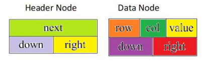
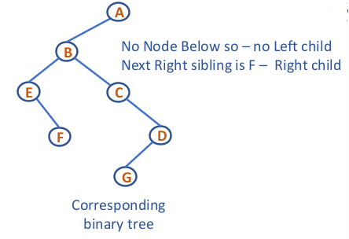

<link rel="stylesheet" href="notes.css">
<!-- Author: WIZ/Aditya -->

# NOTES

## Contents

- [NOTES](#notes)
  - [Contents](#contents)
  - [UNIT - 1](#unit---1)
    - [Memory Allocation](#memory-allocation)
      - [Static Memory Allocation](#static-memory-allocation)
      - [Dynamic Memory Allocation](#dynamic-memory-allocation)
    - [Linked List](#linked-list)
      - [Singly Linked List](#singly-linked-list)
      - [Doubly Linked List](#doubly-linked-list)
      - [Circular Singly Linked List](#circular-singly-linked-list)
      - [Circular Doubly Linked List](#circular-doubly-linked-list)
      - [Multi List](#multi-list)
      - [Skip List](#skip-list)
    - [STACKS](#stacks)
      - [Array implementation](#array-implementation)
      - [LL implementation](#ll-implementation)
      - [Structure implementation](#structure-implementation)
    - [Application of Stack](#application-of-stack)
      - [Tower of Hanoi](#tower-of-hanoi)
      - [Infix to postfix](#infix-to-postfix)
      - [Infix to prefix](#infix-to-prefix)
      - [Check for balanced parenthesis](#check-for-balanced-parenthesis)
  - [UNIT - 2](#unit---2)
    - [Queue](#queue)
      - [Array Implementation](#array-implementation-1)
      - [Linked List Implementation](#linked-list-implementation)
    - [Double Ended Queue](#double-ended-queue)
    - [Circular Queue](#circular-queue)
      - [Array Implementations](#array-implementations)
    - [Priority Queue](#priority-queue)
      - [Array Implementation](#array-implementation-2)
      - [Linked List Implementation](#linked-list-implementation-1)
    - [Applications of Queue](#applications-of-queue)
      - [Josephus Problem](#josephus-problem)
      - [CPU Scheduling](#cpu-scheduling)
    - [Tree](#tree)
      - [Binary Tree](#binary-tree)
      - [N-ary Tree](#n-ary-tree)

---

## UNIT - 1

### Memory Allocation

#### Static Memory Allocation

- Exact size and type of memory must be known at compile time
- Exact size and type of memory must be known at compile time
- Memory is allocated in stack area

```c
int b;
int c[10] ;
```

- Disadvantages

  - Memory allocated can not be altered during run time as it
    is allocated during compile time
  - This may lead to under utilization or over utilization of
    memory
  - Memory can not be deleted explicitly only contents can
    be overwritten
  - Useful only when data size is fixed and known before
    processing

#### Dynamic Memory Allocation

- Dynamic memory allocation is used to obtain and
  release memory during program execution.
- It operates at a low-level
- Memory Management functions are used for allocating
  and deallocating memory during execution of program
- These functions are defined in “stdlib.h”
- Dynamic Memory Allocation Functions:
  - Allocate memory - malloc(), calloc(), and realloc()
  - Free memory - free()

```c
int *p;
if ((p = (int*)malloc(100 * sizeof(int))) == NULL){
  printf("out of memory\n");
  exit();
}
int *ptr;
ptr=(int*)calloc(100,sizeof(int));
```

### Linked List

#### Singly Linked List

```c
// Structure to represent a node
struct node {
    int data;
    struct node *link;
};
typedef struct node NODE;

// Structure to represent a linked list
struct list {
    NODE *head;
};
typedef struct list LIST;

```


```c
// Initialize the list with an empty head
void init_list(LIST *ptr_list) {
    ptr_list->head = NULL;
}
```

- Insertion

```c
// Insert node at the head of the list
void insert_head(LIST *ptr_list, int data) {
    NODE *temp = (NODE *)malloc(sizeof(NODE));
    temp->data = data;
    temp->link = ptr_list->head;
    ptr_list->head = temp;
}

// Insert node at the end of the list
void insert_end(LIST *ptr_list, int data) {
    NODE *pres = ptr_list->head;
    NODE *temp = (NODE *)malloc(sizeof(NODE));
    temp->data = data;
    temp->link = NULL;

    if (pres == NULL) {
        ptr_list->head = temp;
    } else {
        while (pres->link != NULL)
            pres = pres->link;
        pres->link = temp;
    }
}

// Insert node at a specific position in the list
void insert_pos(LIST *ptr_list, int data, int pos) {
    NODE *pres = ptr_list->head, *temp;
    int i = 1;
    temp = (NODE *)malloc(sizeof(NODE));
    temp->data = data;
    temp->link = NULL;

    if (pos == 1) {
        temp->link = ptr_list->head;
        ptr_list->head = temp;
        return;
    }

    while (pres != NULL && i < pos - 1) {
        pres = pres->link;
        i++;
    }

    if (pres != NULL) {
        temp->link = pres->link;
        pres->link = temp;
    } else {
        printf("\nInvalid position.\n");
    }
}
```

- Display

```c
// Display the list
void display(LIST *ptr_list) {
    NODE *pres = ptr_list->head;
    if (pres == NULL) {
        printf("\nEmpty list.\n");
    } else {
        while (pres != NULL) {
            printf("%d --> ", pres->data);
            pres = pres->link;
        }
    }
}
```

- Deletion

```c
// Delete node by value
void delete_node(LIST *ptr_list, int data) {
    NODE *pres = ptr_list->head, *prev = NULL;

    while (pres != NULL && pres->data != data) {
        prev = pres;
        pres = pres->link;
    }

    if (pres != NULL) {
        if (prev == NULL) {
            ptr_list->head = pres->link;
        } else {
            prev->link = pres->link;
        }
        free(pres);
    } else {
        printf("Node not found..\n");
    }
}

// Delete node at a specific position
void delete_pos(LIST *ptr_list, int pos) {
    NODE *pres = ptr_list->head, *prev = NULL;
    int i = 1;

    while (pres != NULL && i < pos) {
        prev = pres;
        pres = pres->link;
        i++;
    }

    if (pres != NULL) {
        if (prev == NULL) {
            ptr_list->head = pres->link;
        } else {
            prev->link = pres->link;
        }
        free(pres);
    } else {
        printf("Invalid Position..\n");
    }
}

// Delete alternate nodes
void delete_alternate(LIST *ptr_list) {
    NODE *pres = ptr_list->head, *prev = NULL;

    while (pres != NULL) {
        if (prev == NULL) {
            ptr_list->head = pres->link;
        } else {
            prev->link = pres->link;
        }
        prev = pres->link;
        if (prev != NULL)
            pres = prev->link;
        else
            pres = NULL;
    }
}
```

#### Doubly Linked List

```c
struct node
{
    int key;       // Data (value) of the node
    struct node *next;  // Pointer to the next node
    struct node *prev;  // Pointer to the previous node
};

typedef struct node NODE;

struct dlist
{
    NODE *head;     // Pointer to the head node
                    // (first node of the list)
};

typedef struct dlist DLIST;
```


```c
void init_list(DLIST *ptr_list)
{
    // Initialize the list with an empty head
    ptr_list->head = NULL;
}
```

- Insertion

```c
void insert_head(DLIST *ptr_list, int key)
{
    // Allocate memory for a new node
    NODE *temp = (NODE *)malloc(sizeof(NODE));
    temp->key = key;
    temp->next = temp->prev = NULL;

    if (ptr_list->head == NULL)
        // If the list is empty, make temp the head
        ptr_list->head = temp;
    else
    {
        temp->next = ptr_list->head;
         // Point new node to current head
        ptr_list->head->prev = temp;
        // Point current head's prev to new node
        ptr_list->head = temp;  // Update the head to the new node
    }
}
void insert_tail(DLIST *ptr_list, int key)
{
    NODE *temp, *pres;
    // Allocate memory for a new node
    temp = (NODE *)malloc(sizeof(NODE));
    temp->key = key;
    temp->next = temp->prev = NULL;

    if (ptr_list->head == NULL)
      // If the list is empty, make temp the head
      ptr_list->head = temp;
    else
    {
      pres = ptr_list->head;
      // Traverse to the last node
      while (pres->next != NULL)
          pres = pres->next;

      // Make the last node point to the new node
      pres->next = temp;
      // Make the new node's prev point to the last node
      temp->prev = pres;
    }
}
```

- Display

```c
void display(DLIST *ptr_list)
{
    NODE *pres = ptr_list->head;  // Start from the head

    if (pres == NULL)
        printf("\nEmpty List..\n");
    else
    {
        while (pres != NULL)
        {
            printf("%d<->", pres->key);  // Print the key
            pres = pres->next;  // Move to the next node
        }
    }
    printf("\n");
}
```

- Deletion

```c
void delete_first(DLIST *ptr_list)
{
  NODE *pres = ptr_list->head;

  if (pres->next == NULL)
    // Only one node, set head to NULL
    ptr_list->head = NULL;
  else
  {
    // Make the second node's prev NULL
    pres->next->prev = NULL;
    // Update the head to the second node
    ptr_list->head = pres->next;
  }
  free(pres);  // Free the memory of the deleted node
}
void delete_last(DLIST *ptr_list)
{
    NODE *pres = ptr_list->head;

    if (pres->next == NULL)  // Only one node
        ptr_list->head = NULL;
    else
    {
        while (pres->next != NULL)  // Traverse to the last node
            pres = pres->next;

        // Make the second-to-last node's next NULL
        pres->prev->next = NULL;
    }
    free(pres);  // Free the memory of the last node
}
```

> If You want **explaination** for these code maybe stop cs engg and become prompt engg and <span class="highlight">**ASK GPT**</span>
>
> ⎛⎝(•ⱅ•)⎠⎞

#### Circular Singly Linked List

```c
struct node
{
    int data;
    struct node *link;
};

typedef struct node NODE;

struct list
{
    NODE *last;
};

typedef struct list CLIST;
```


```c
void init_list(CLIST *ptr_list)
{
    ptr_list->last = NULL;
}
```

- Insertion

```c
void insert_front(CLIST *ptr_list, int data)
{
    NODE *temp, *p;

    // Create a new node
    temp = (NODE*)malloc(sizeof(NODE));
    temp->data = data;
    temp->link = temp;  // Links to itself (circular)

    p = ptr_list->last;  // Get the address of the last node

    if(p == NULL)  // First node (empty list)
        ptr_list->last = temp;
    else
    {
        temp->link = p->link;
        p->link = temp;
    }
}
void insert_end(CLIST *ptr_list, int data)
{
    NODE *temp, *p;

    // Create a new node
    temp = (NODE*)malloc(sizeof(NODE));
    temp->data = data;
    temp->link = temp;  // Links to itself (circular)

    p = ptr_list->last;  // Get the address of the last node

    if(p == NULL)  // Empty list
        ptr_list->last = temp;  // First node
    else
    {
        temp->link = p->link;  // Link after the last node
        p->link = temp;
        ptr_list->last = temp;  // Update the last pointer
    }
}
```

- Display

```c
void display(CLIST* ptr_list)
{
    NODE *pres, *end;

    if(ptr_list->last == NULL)
        printf("Empty List\n");
    else
    {
        end = ptr_list->last;  // Copy last node's address
        pres = end->link;  // Point to the first node

        while(pres != end)
        {
            printf("%d ->", pres->data);
            pres = pres->link;
        }
        printf("%d ", pres->data);  // Print the last node
    }
}
```

- Deletion

```c
void delete_node(CLIST* ptr_list, int data)
{
    NODE *end, *pres, *prev;
    end = ptr_list->last;  // Copy address of the last node
    pres = end->link;  // Point to the first node
    prev = end;

    // Find the node with the given data
    while((pres->data != data) && (pres != end))
    {
        prev = pres;
        pres = pres->link;
    }

    if(pres->data == data)
    {
        // If only one node
        if(pres->link == pres)
            ptr_list->last = NULL;
        else
        {
            // Link the previous node to the next node
            prev->link = pres->link;
            if(pres == end)  // If deleting the last node
                ptr_list->last = prev;  // Update the last pointer
        }
        free(pres);
    }
    else
        printf("Data not found..\n");
}
```

#### Circular Doubly Linked List

```c
struct node {
    int data;
    struct node *next;
    struct node *prev;
};

typedef struct node NODE;

struct list {
    NODE *head;
};
```


```c
void init_list(CDLL *ptr_list) {
    ptr_list->head = NULL;
}
```

- Insertion

```c
void insert_front(CDLL *ptr_list, int data) {
    NODE *temp;

    // Create new node
    temp = (NODE *)malloc(sizeof(NODE));
    temp->data = data;

    if (ptr_list->head == NULL) {  // If the list is empty
        temp->next = temp;  // Points to itself
        temp->prev = temp;  // Points to itself
        ptr_list->head = temp;  // Head points to the new node
    } else {
        // Next node points to current head
        temp->next = ptr_list->head;
        // Previous node points to current last
        temp->prev = ptr_list->head->prev;
        // Last node's next points to the new node
        ptr_list->head->prev->next = temp;
        // Head's previous points to the new node
        ptr_list->head->prev = temp;
        // Make new node as head
        ptr_list->head = temp;
    }
}
void insert_end(CDLL *ptr_list, int data) {
    NODE *temp;

    // Create new node
    temp = (NODE *)malloc(sizeof(NODE));
    temp->data = data;

    if (ptr_list->head == NULL) {  // If the list is empty
        temp->next = temp;  // Points to itself
        temp->prev = temp;  // Points to itself
        ptr_list->head = temp;  // Head points to the new node
    } else {
        // Next points to the head
        temp->next = ptr_list->head;
        // Previous points to the current last node
        temp->prev = ptr_list->head->prev;
        // Last node's next points to the new node
        ptr_list->head->prev->next = temp;
        // Head's previous points to the new node
        ptr_list->head->prev = temp;
    }
}
```

- Display

```c
void display(CDLL *ptr_list) {
    NODE *pres;

    if (ptr_list->head == NULL) {
        printf("Empty List\n");
    } else {
        pres = ptr_list->head;

        // Traverse the list in forward direction
        do {
            printf("%d <-> ", pres->data);
            pres = pres->next;
        } while (pres != ptr_list->head);
        // Stop when we circle back to head

        printf("(Head)\n");
    }
}
```

- Deletion

```c
void delete_node(CDLL *ptr_list, int data) {
    NODE *temp, *pres;

    if (ptr_list->head == NULL) {
        printf("List is empty\n");
        return;
    }

    pres = ptr_list->head;

    // Traverse the list to find the node
    do {
        if (pres->data == data) {
            temp = pres;

            if (pres->next == pres) {  // If there's only one node
              ptr_list->head = NULL;  // List becomes empty
            } else {
              // Previous node's next points to the next node
              pres->prev->next = pres->next;
              // Next node's previous points to the previous node
              pres->next->prev = pres->prev;
              if (pres == ptr_list->head) {
                // If head is to be deleted, update head
                 ptr_list->head = pres->next;
              }
            }

            free(temp);
            printf("Node with data %d deleted\n", data);
            return;
        }
        pres = pres->next;
    } while (pres != ptr_list->head);
    // Stop when we circle back to head
    printf("Data not found\n");
}
```

#### Multi List

- OK So multi list(Sparse list) is basically a 2D List of a matrix
- The main point being we just dont include 0s' in the list at all
- There are two Nodes for this list
  

  $$
  \begin{bmatrix}
  2 & 0 & 0 &0 \\
  4 & 0 & 0 & 3 \\
  0 & 0 & 0 & 0 \\
  8 & 0 & 0 & 1 \\
  0 & 0 & 6 & 0
  \end{bmatrix}
  $$

  

- You can imagine what functions we have with these , no implementation so less work for me

#### Skip List

- This is basically a list where we keep multiple copies with some missing elements who are attached to each other


- Skip Lists support O(log n)

  - Insertion
  - Deletion
  - Search

- Ok SO lets say we wanna go to 60 how do we go
- Some basic rule would look like
  - x = y: we return element(after(p))
  - x > y: we “scan forward”
  - x < y: we “drop down”
    
- For Insertion We use a random function to tell us inside how many rows should the element be in
- For deletion we delete all the appearing node of that data and if there are more than one empty row then we delete the extras

### STACKS

- Definition: A stack is a linear data structure that follows the Last In, First Out (LIFO) principle, meaning the last element added is the first to be removed.

- Basic Operations:
  - Push: Adds an element to the top of the stack.
  - Pop: Removes the top element from the stack.
  - isEmpty: Checks if the stack is empty.


- Implementation:

  - Can be implemented using arrays or linked lists.
  - In an array-based stack, a fixed size is predefined.
  - In a linked-list-based stack, dynamic memory allocation is used.

- Applications:

  - Expression evaluation: Infix to postfix conversion, postfix evaluation.
  - Backtracking: Undo operations in text editors, solving mazes.
  - Function call management: Recursion uses stack memory.
  - Browser navigation: Forward and backward navigation.

- Complexity:

  - Push, Pop, and Peek operations are performed in O(1) time.

- Limitations:

  - Fixed size in array-based stacks can lead to stack overflow.
  - Linked-list-based stacks require additional memory for pointers.

#### Array implementation

> There is no need of structure in array implementation COS we use a <span class="highlight">**FUCKING ARRAY**</span>
>
> ⎛⎝(•ⱅ•)⎠⎞

- Push Function

```c
int push(int *s, int *top, int size, int ele)
{
    if (*top == size - 1) // Check for stack overflow
    {
        printf("STACK IS OVERFLOWING\n");
        return 0;
    }
    *top = *top + 1; // Increment top
    s[*top] = ele;   // Insert element at the new top position
    return 1;        // Return success
}
```

- Pop Function

```c
int pop(int *s, int *top, int size)
{
    if (*top == -1) // Check for stack underflow
    {
        printf("Stack is underflow\n");
        return 0;
    }
    int ele = s[*top]; // Store the top element to return later
    *top = *top - 1;   // Decrement top
    return ele;        // Return the popped element
}
```

- Display Function

```c
void display(int *s, int top, int size)
{
    if (top == -1) // Check if the stack is empty
    {
        printf("Stack is empty\n");
    }
    else
    {
        printf("Stack elements are:\n");
        // Traverse from top to bottom
        for (int i = top; i >= 0; i--)
        {
            printf("%d ", s[i]);
        }
        printf("\n");
    }
}
```

> If Any of these Functions Confuse you <span class="highlight">_YOU ARE COOKED_</span>
>
> ⎛⎝(•ⱅ•)⎠⎞

#### LL implementation

- FOR Linked list implementation guess what we use <span class=highlight>FUCKING LINKED LIST</span>
<figure>
<figcaption>
IKR FUCKING MIND BOGGLING
</figcaption>
</figure>

```c
// Node structure for each stack element
typedef struct node
{
    int data;           // Data part of the node
    struct node *link;  // Pointer to the next node
} NODE;

// Stack structure with a pointer to the top node
typedef struct stack
{
    NODE *top;          // Pointer to the top of the stack
} STACK;
```

Anyways here's the code for the functions,you might but `WIZ` Where is the main function , To that i say **_fuck you_** make your own (◕‿◕✿)

- INIT

```c
// Initialize the stack by setting the top to NULL
void init(STACK *ptr)
{
    ptr->top = NULL;
}
```

- If you are wondering why do all this ,why extra init function? _WELL_ <br/>

- What if you have more than one stack or you don'y know how many you have yet
  <br/>- Thats why we do this

- PUSH

```c
// Push an element onto the stack
void push(STACK *ptr, int ele)
{
    // Create and populate a new node
    NODE *temp = (NODE *)malloc(sizeof(NODE));
    temp->data = ele;   // Set the data part
    temp->link = NULL;  // Initialize the link to NULL

    // Insert the new node at the top of the stack
    temp->link = ptr->top; // Point new node to the current top
    ptr->top = temp;       // Update top to the new node
}
```

- POP

```c
// Pop the top element from the stack
int pop(STACK *ptr)
{
    NODE *p;
    int data;

    p = ptr->top;       // Point to the current top
    if (p == NULL)      // Check for empty stack
    {
        printf("Empty stack\n");
        return 0;
    }

    // Retrieve and remove the top element
    data = p->data;         // Get the data from the top node
    ptr->top = p->link;     // Update top to the next node
    free(p);                // Free the memory of the removed node
    return data;            // Return the popped data
}
```

- DISPLAY

```c
// Display all elements in the stack
void display(STACK *ptr)
{
    NODE *p = ptr->top;  // Start from the top of the stack

    if (p == NULL)       // Check if the stack is empty
    {
        printf("Empty stack\n");
    }
    else
    {
        // Traverse the stack and print elements
        while (p != NULL)
        {
            // Print current node's data
            printf("%d --> ", p->data);
            p = p->link;    // Move to the next node
        }
        printf("NULL\n");              // End of stack
    }
}
```

```bash
Output :
10 --> 11 --> NULL
```

#### Structure implementation

- OK , Remember how we made array implementation
- But what if we need more than one and can't hardcode the number of stacks
- That's when we use Structure implementation

```c
// Define a structure for stack
typedef struct stack
{
  int *s;     // Pointer to the array holding stack elements
  int top;    // Index of the top element
  int size;   // Maximum size of the stack
} STACK;
```

- INIT

```c
void init(STACK *stk, int size)
{
    stk->size = size;                 // Set the size of the stack
    // Allocate memory array
    stk->s = (int *)malloc(size * sizeof(int));
    if (stk->s == NULL)
    {
        printf("Memory allocation failed!\n");
        exit(1); // Exit if allocation fails
    }
    stk->top = -1; // Initialize the stack as empty
}
```

- IS EMPTY

```c
int isEmpty(STACK *stk) {//returns true or false
    return stk->top == -1;
}
```

- Push

```c
// Push an element onto the stack
int push(STACK *p, int x)
{
  // Check for stack overflow
  if (p->top == p->size - 1)
  {
    printf("Stack overflow..\n");
    return 0;
  }

  // Increment the top and add the new element
  p->top++;            // Move the top pointer
  p->s[p->top] = x;    // Store the element at the top
  return 1;            // Indicate successful operation
}
```

- Pop

```c
// Pop the top element from the stack
int pop(STACK *p)
{
  int x;

  // Check for stack underflow
  if (p->top == -1)
  {
    printf("Stack underflow..\n");
    return 0;
  }

  // Retrieve and remove the top element
  x = p->s[p->top];    // Get the element at the top
  p->top--;            // Move the top pointer down
  return x;            // Return the popped element
}
```

- Display

```c
// Display all elements in the stack
void display(STACK p)
{
  int i;

  // Check if the stack is empty
  if (p.top == -1)
    printf("\nStack empty..\n");
  else
  {
    // Traverse and print all elements from top to bottom
    for (i = p.top; i >= 0; i--)
      printf("%d  ", p.s[i]);
    printf("\n");
  }
}
```

### Application of Stack

#### Tower of Hanoi

- If a solution to n-1 disks is found, then the problem would be
  solved. Because in the trivial case of one disk, the solution would
  be to move the single disk from Peg A to Peg C.
- To move n disks from A to C , the recursive solution would be as
  follows

  - If n=1 move the single disk from A to C and stop
  - Move the top n-1 disks from A to B using C as auxillary
  - Move the remaining disk from A to C
  - Move n-1 disks from B to C using A as the auxillary
    

```c
void tower(int n,char src,char tmp,char dst)
{
    if(n==1)
    {
        printf("\nMove disk %d from %c to %c",n,src,dst);
        return;
    }
    tower(n-1,src,dst,tmp);
    printf("\nMove disk %d form %c to %c",n,src,dst);
    tower(n-1,tmp,src,dst);
    return;
}
```

- Expressions consist of operands and operators. They can be categorized into three types:

  - Infix Notation
  <pre>
      Format: <op> <opr> <op>
      Example: A + B
  </pre>
  - Prefix Notation
    <pre>
      Format: <opr> <op> <op>
      Example: +AB
  </pre>
  - Postfix Notation
    <pre>
        Format: <op> <op> <opr>
        Example: AB+
    </pre>

#### Infix to postfix

- ALGORITHM FOR INFIX to POSTFIX:
  - Input is the token of the infix expression - char array
    1.  Create an empty stack called opstack for keeping operators.
    2.  Create an empty array for the output.
    3.  Scan the input array from L-R
        - If the token is an operand, add it to the output array.
        - If the token is a left paranthesis (, push it on to the stack.
        - IF the token is a right paranthesis ) , pop the stack until the
          corresponding left paranthesis is found. Add all the operators to the
          end of the output array.
        - If the token is an operator`*,/,+,(,-` push it on to stack.
          However, first remove any operator already on the stack that has higher
          or equal precedence and add them to the output array.
    4.  When the input is completely processed, check the stack for any leftover
        operators. Pop them to the end of the output array.
- Here the code for implementation

```c
int main()
{
    char infix[10], postfix[10];
    printf("\nEnter valid Infix Expression\n");
    scanf("%s", infix);
    convert_postfix(infix, postfix);
    printf("\nThe postfix equivalent=%s\n", postfix);
}
```

- Stack precendence

```c
int stack_prec(char ch)
{
    switch (ch)
    {
        case '+':
        case '-':
            // Lower precedence for addition and subtraction
            return 2;
        case '*':
        case '/':
            // Higher precedence for multiplication and division
            return 4;
        case '(':
            // Opening parenthesis has the lowest precedence
            return 0;
        case '#':
            // Marker for the bottom of the stack
            return -1;
        default:
            // Default for operands and unknown characters
            return 6;
    }
}
```

- Input Precendence

```c
int input_prec(char ch)
{
    switch (ch)
    {
        case '+':
        case '-':
            // Lowest precedence for addition and subtraction
            return 1;
        case '*':
        case '/':
            // Higher precedence for multiplication and division
            return 3;
        case '(':
            // Highest precedence for opening parenthesis
            return 7;
        case ')':
            // Low precedence for closing parenthesis
            return 0;
        default:
            // Default for operands (numbers, variables)
            return 5;
    }
}
```

- Conversion code

```c
void convert_postfix(char *infix, char *postfix)
{
    int i, j;
    char ch;
    char s[10]; // stack
    int top = -1;
    i = 0;
    j = 0;
    push(s, &top, '#'); // push # to stack as initial marker

    while (infix[i] != '\0')
    {
        ch = infix[i];

        /* Pop stack until a lower precedence operator
        or open parenthesis is found */
        while (stack_prec(s[top]) > input_prec(ch))
            postfix[j++] = pop(s, &top);

        /* Push the current operator
        if it has higher precedence than the stack top */
        if (input_prec(ch) > stack_prec(s[top]))
            push(s, &top, ch);
        else
            pop(s, &top); // Pop the stack for parenthesis

        i++;
    }

    // Pop remaining operators in the stack to the output
    while (s[top] != '#')
        postfix[j++] = pop(s, &top);

    postfix[j] = '\0'; // Null-terminate the postfix string
}
```

- ALGORITHM FOR EVALUATING A POSTFIX EXPRESSION:

  1. Create a stack called input.
  2. Scan the input from 0 to len-1: L - R
  3. if token is an operand.
     push it on to the input stack.
  4. Otherwise, if the token is an operator
     pop the first two elements on the stack and perform the operation
     based on the operator.
     push the result back onto the stack.
  5. return the top most element -> result of evaluating the postfix exp.

```c
int main() {
    char postfix[100];
    printf("\nEnter the postfix expression\n");
    scanf("%s", postfix);

    int result = postfix_eval(postfix);
    printf("\nThe result = %d\n", result);

    return 0;
}
```

```c
int isoper(char ch) {
    //checks if it is a operator and returns true or false
    if ((ch == '+') || (ch == '-') || (ch == '*') || (ch == '/'))
        return 1;
    return 0;
}
```

- Eval Function

```c
int postfix_eval(char* postfix) {
  int isoper(char);
  int i = 0, result, op1, op2, a;
  char ch;
  stack st; // Initialize a stack
  init_stk(&st);
  // Process each character in the postfix expression
  while (postfix[i] != '\0') {
     ch = postfix[i];
       if (isoper(ch))
      {                 // If the character is an operator
         op1 = pop(&st); // Pop two operands
         op2 = pop(&st);
            // Perform the operation and push the result back
        switch (ch) {
           case '+': result = op2 + op1; push(&st, result); break;
           case '-': result = op2 - op1; push(&st, result); break;
           case '*': result = op2 * op1; push(&st, result); break;
           case '/': result = op2 / op1; push(&st, result); break;
        }
      }
      else { // If the character is an operand
          printf("%c = ", ch);
          scanf("%d", &a); // Read the value of the operand
          push(&st, a);
      }
      i++;
  }
  return pop(&st); // Return the final result
}
```

#### Infix to prefix

- Algorithm: Infix to Prefix Conversion
  - Step 1: Input the Infix Expression
    - Read the infix expression (e.g., `A+B\*(C-D)`).
  - Step 2: Reverse the Infix Expression
    - Reverse the input expression and swap parentheses:
      - Replace `(` with `)` and vice versa.
      - Example: `A+B*(C-D)` → Reversed → `(D-C)*B+A`.
  - Step 3: Convert Reversed Infix to Postfix
    - Details of Infix to Postfix Conversion
      - Initialize a stack:
        - Push a sentinel value `#` onto the stack to signify the bottom of the stack.
      - Scan the reversed infix expression from left to right:
        - For each operand `A, B, C, ...`:
          - Append it to the postfix expression.
        - For each operator `+, -, *, /, ...`:
          - Pop operators from the stack to the postfix expression while the operator's precedence on the stack is greater or equal to the incoming operator's precedence.
          - Push the incoming operator onto the stack.
        - For parentheses:
          - Push `(` onto the stack when encountered.
          - Pop operators from the stack to the postfix expression until `)` is found, then discard the `)`.
        - Pop remaining operators from the stack:
          - Append them to the postfix expression until the sentinel `#` is reached.
        - Result:
          - The output is the postfix equivalent of the reversed infix expression.
  - Step 4: Reverse the Postfix Expression
    - Reverse the postfix expression to get the prefix equivalent.
      - Example: Postfix → `DC-B*A+` → Reversed → `+A*B-CD`.
  - Step 5: Output the Prefix Expression
    - Display the resulting prefix expression.
- Example Walkthrough

  - Input:
    - Infix Expression: `A+B*(C-D)`

---

- Reverse and Adjust Parentheses:

  1. Infix: `A+B*(C-D)`
  2. Reversed: `(D-C)*B+A`

- Convert to Postfix:

  1. Reversed Infix: `(D-C)*B+A`

  - Postfix Conversion:
    - Scan `(` → Push onto stack.
    - Scan `D` → Append to postfix: `D`.
    - Scan `-` → Push onto stack.
    - Scan `C` → Append to postfix: `D C`.
    - Scan `)` → Pop operators to postfix until `(` is encountered: `D C -`.
    - Scan `*` → Push onto stack.
    - Scan `B` → Append to postfix: `D C - B`.
    - Scan `+` → Push onto stack (lower precedence than `*`).
    - Scan `A` → Append to postfix: `D C - B * A`.
    - Scan `\0`→ Pop The rest of the Stack
  - Resulting Postfix:` D C - B * A +`

- Reverse the Postfix:

  - Postfix: `D C - B * A +`
  - Reversed: `+ A * B - C D`

- Output the Prefix Expression:
  - Prefix: `+A\*B-CD`.

```c
void reverse_string(char *a, char *b) {
    int i = strlen(a) - 1, j = 0;

    // Loop through the string backward
    while (i >= 0) {
        if (a[i] == '(')
            b[j++] = ')';
        else if (a[i] == ')')
            b[j++] = '(';
        else
            b[j++] = a[i]; // Copy other characters
        i--;
    }

    // Null-terminate the reversed string
    b[j] = '\0';
}
```

```c
int main()
{
  char infix[100],prefix[100], reverse[100],postfix[100];

  // Get infix expression input from the user
  printf("\nEnter valid Infix Expression\n");
  scanf("%s",infix);

  /* Reverse the infix expression and
  store it in the 'reverse' array     */
  reverse_string(infix, reverse);
  printf("Reversed = %s\n", reverse);

  // Convert the reversed infix expression to a postfix expression
  convert_postfix(reverse, postfix);
  printf("\npostfix equivalent = %s",postfix);

  // Reverse the postfix expression to get the prefix expression
  reverse_string(postfix, prefix);
  printf("\nThe prefix equivalent=%s\n",prefix);
}
```

- Precedence Function

```c
int input_prec(char ch)
{
    switch(ch)
    {
        case '+':
        case '-': return 2;
        // Lower precedence for '+' and '-' compared to postfix
        case '*':
        case '/': return 4;
        // Higher precedence for '*' and '/' compared to postfix
        case '(': return 7;
        // '(' has the highest precedence when it is the input
        case ')': return 0;
        // ')' has the lowest precedence when it is the input
        default: return 5;
        // For operands (like variables), precedence is constant
    }
}
/* Function to return the stack precedence of the operator */
int stack_prec(char ch)
{
    switch(ch)
    {
        case '+':
        case '-': return 1;
        // Stack precedence is lower for '+' and '-'
        case '*':
        case '/': return 3;
        // Stack precedence is lower for '*' and '/'
        case '(': return 0;
        // '(' has the lowest precedence when it is on the stack
        case '#': return -1;
        // Sentinel value '#' has the lowest precedence
        default: return 6;
        // For operands (like variables), precedence is constant
    }
}
```

- Convert To Postfix

```c
/* Function to convert infix to postfix expression */
void convert_postfix(char *infix, char *postfix)
{
    char s[100]; // Stack to hold operators and parentheses
    int top = -1, i, j;
    i = 0;
    char ch;
    j = 0;

    // Push '#' onto the stack as a sentinel value
    push(s, &top, '#');

    // Loop through the infix expression from left to right
    while(infix[i] != '\0')
    {
        ch = infix[i];

        /* Pop from the stack
        if input precedence is lower than stack precedence*/
        while(input_prec(ch) < stack_prec(peep(s, top)))
            postfix[j++] = pop(s, &top);

        /* Push to the stack
        if input precedence is higher than stack precedence*/
        if(input_prec(ch) > stack_prec(peep(s, top)))
            push(s, &top, ch);
        else
// If the precedence is equal, this happens when ')' matches '('
            pop(s, &top);
        i++;
    }

    /* Pop remaining operators from the stack
     and store in postfix expression*/
    while(peep(s, top) != '#')
        postfix[j++] = pop(s, &top);

    // Null-terminate the postfix string
    postfix[j] = '\0';
}
```

#### Check for balanced parenthesis

- Some helpers:

```c
// Function to return the top element of the stack
char topmost(stack* S) {
    if (!isEmpty(S)) {
        return S->items[S->top];
    }
    return '\0';
}
/* Function to check whether two characters
are opening and closing of the same type    */
int arePair(char opening, char closing) {
    if (opening == '(' && closing == ')') return 1;
    else if (opening == '{' && closing == '}') return 1;
    else if (opening == '[' && closing == ']') return 1;
    return 0;
}
```

- Checker

```c
// Function to check whether the parentheses are balanced
int check_balance(char* exp) {
    stack S;
    initStack(&S);

    for (int i = 0; i < strlen(exp); i++) {
        // Push opening brackets onto the stack
        if (exp[i] == '(' || exp[i] == '{' || exp[i] == '[') {
            push(&S, exp[i]);
        }
        /* For closing brackets,
        check if they match the top of the stack*/
        else if (exp[i] == ')' || exp[i] == '}' || exp[i] == ']')
        {
            if (isEmpty(&S) || !arePair(topmost(&S), exp[i])) {
                return 0; // Not balanced
            } else {
                pop(&S); // Match found, pop the stack
            }
        }
    }

    // If stack is empty, all parentheses were matched
    return isEmpty(&S);
}
```

## UNIT - 2

### Queue


> Look at the diagram i didn't draw in a few mins cos i couldn't find a good image on the web yea the <span class="highlight">top one is Array and the bottom is Linked List</span>
>
> ⎛⎝(•ⱅ•)⎠⎞

#### Array Implementation


- Enqueue Operation (Inserting an element)

```c
void enQ(int *q, int *rear, int ele) {
    if (*rear == max - 1) {  // Check if the queue is full
        printf("Queue is full\n");
    } else {
        // Increment the rear pointer
        *rear = *rear + 1;
        // Add the element to the rear of the queue
        q[*rear] = ele;
    }
}
```

- Dequeue Operation (Removing an element)

<figure>
<figcaption>
THIS IS **NOT** FUCKING DOUBLE ENDED you numbskull
<figcaption>
</figure>
```c
int deQ(int *q, int *front, int rear) {
    if (*front > rear)  // Check if the queue is empty
        return 0;  // Return 0 to indicate empty queue
    else {
        int x = q[*front];  // Store the element to be deleted
        *front = *front + 1;  // Increment the front pointer
        return x;  // Return the deleted element
    }
}
```

- Display

```c
  void display(int *q, int rear, int front) {
    if (front > rear) {  // Check if the queue is empty
        printf("Queue is empty\n");
    } else {
        for (int i = front; i <= rear; i++) {
            // Display all elements from front to rear
            printf("%d ", q[i]);
        }
    }
}
```

#### Linked List Implementation


- Again the same shenanigans

```c
typedef struct node
{
	int data;
	struct node *link;
} NODE;

typedef struct queue
{
		NODE *front, *rear;
} QUEUE;
```

- INIT

```c
QUEUE *createqueue()
{
    /* Allocate memory for a new queue*/
    QUEUE *temp = (QUEUE *)malloc(sizeof(QUEUE));
    if (temp != NULL)
    {
        // Initialize both front and rear to NULL (empty queue)
        temp->front = temp->rear = NULL;
    }
    return (temp);  // Return the created queue
}
```

- Enqueue

```c
void enqueue(QUEUE *ptr, int ele)
{
  // Allocate memory for a new node
  NODE *temp = (NODE *)malloc(sizeof(NODE));
  // Set the node's data to the input element
  temp->data = ele;
  // Set the node's link to NULL (end of the queue)
  temp->link = NULL;

  // If the queue is empty
  if (ptr->front == NULL && ptr->rear == NULL)
  {
    // The new node becomes both the front and the rear
    ptr->front = ptr->rear = temp;
    return;
  }

  // Link the current rear node to the new node
  ptr->rear->link = temp;
  // Set the new node as the new rear of the queue
  ptr->rear = temp;
}
```

- Dequeue

```c
int dequeue(QUEUE *ptr)
{
  // If the queue is empty
  if (ptr->front == NULL && ptr->rear == NULL)
  {
    return 0; // Return 0 to indicate the queue is empty
  }
  else
  {
    // Save the front node to be deleted
    NODE *first = ptr->front;
    // If the queue has only one element
    if (first->link == NULL)
    {
      // Set the front to NULL
      ptr->front = first->link;
      // Save the data to return
      int x = first->data;
      // Free the memory of the first node
      free(first);
      // Set both to NULL (queue is empty)
      ptr->front = ptr->rear = NULL;
      // Return the deleted data
      return (x);
    }

    ptr->front = first->link;
    int x = first->data;// Save the data to return
    free(first);        // Free the memory of the first node
    return (x);         // Return the deleted data
  }
}
```

- Display

```c
void display(QUEUE *ptr)
{
    // If the queue is empty
    if (ptr->front == NULL && ptr->rear == NULL)
    {
        printf("empty");
    }
    else
    {
        NODE *cur = ptr->front; // Start from the front node
        while (cur != NULL)     // Traverse until the end
        {
            printf("%d\t", cur->data);
            cur = cur->link;    // Move to the next node
        }
    }
}
```

### Double Ended Queue


```c
#include <stdlib.h>
#include <stdio.h>

struct node {
    // Data stored in the node
    int key;
    // Pointers to the next and previous nodes
    struct node *next, *prev;
};

typedef struct node NODE;    // Alias for struct node

// Define the structure of the dequeue (double-ended queue)
struct dequeue {
    NODE *front;  // Pointer to the front node of the deque
    NODE *rear;   // Pointer to the rear node of the deque
};

typedef struct dequeue DblQueue;  // Alias for struct dequeue
```

- INIT

```c
// Initialize the deque
void init(DblQueue *p) {
    // Set both front and rear to NULL (empty deque)
    p->front = p->rear = NULL;
}
```

- Insertion

```c
// Insert a node at the head (front) of the deque
void qinsert_head(DEQ *p, int x) {
    NODE *temp;

    // Create a new node
    temp = (NODE *)malloc(sizeof(NODE));
    temp->key = x;
    // Initialize the node's next and prev to NULL
    temp->next = temp->prev = NULL;

    // If deque is empty, set both front and rear to the new node
    if (p->front == NULL)
        p->front = p->rear = temp;
    else {
        // Link the new node's next to the current front
        temp->next = p->front;
        // Link the current front's prev to the new node
        p->front->prev = temp;
        // Update front to the new node
        p->front = temp;
    }
}
// Insert a node at the tail (rear) of the deque
void qinsert_tail(DEQ *p, int x) {
    NODE *temp;

    // Create a new node
    temp = (NODE *)malloc(sizeof(NODE));
    temp->key = x;
    // Initialize the node's next and prev to NULL
    temp->next = temp->prev = NULL;

    // If deque is empty, set both front and rear to the new node
    if (p->front == NULL)
        p->front = p->rear = temp;
    else {
        // Link the current rear's next to the new node
        p->rear->next = temp;
        // Link the new node's prev to the current rear
        temp->prev = p->rear;
        // Update rear to the new node
        p->rear = temp;
    }
}
```

- Deletion

```c
// Delete a node from the tail (rear) of the deque
int qdelete_tail(DEQ *p) {
    NODE *pres;
    int key;

    // Check if deque is empty
    if (p->rear == NULL) {
        printf("Dequeue is empty\n");
        return -1;
    }

    pres = p->rear;  // Current rear node
    key = pres->key; // Store the key to return after deletion

    // If only one node exists, set both front and rear to NULL
    if (p->front == p->rear)
        p->front = p->rear = NULL;
    else {
        // Move the rear pointer to the previous node
        p->rear = pres->prev;
        // Update the new rear's next pointer
        p->rear->next = NULL;
    }
    free(pres);  // Free the deleted node
    return key;  // Return the deleted value
}
// Delete a node from the head (front) of the deque
int qdelete_head(DEQ *p) {
    NODE *pres;
    int key;

    // Check if deque is empty
    if (p->front == NULL) {
        printf("Dequeue is empty\n");
        return -1;
    }

    pres = p->front;  // Current front node
    key = pres->key;  // Store the key to return after deletion

    // If only one node exists, set both front and rear to NULL
    if (p->front == p->rear)
        p->front = p->rear = NULL;
    else {
        // Move the front pointer to the next node
        p->front = pres->next;
        // Update the new front's prev pointer
        p->front->prev = NULL;
    }
    free(pres);  // Free the deleted node
    return key;  // Return the deleted value
}
```

- Display

```c
// Display the contents of the deque
void qdisplay(DEQ *p) {
    NODE *pres;

    // Check if deque is empty
    if (p->front == NULL)
        printf("Empty Dequeue\n");
    else {
        pres = p->front;  // Start from the front

        // Traverse the deque and print each node's key
        while (pres != p->rear) {
            printf("%d<->", pres->key);
            pres = pres->next;
        }
        printf("%d\n", pres->key);  // Print the last node
    }
}
```

### Circular Queue


> OK So pes gave me only array code so my advice is to use the circular linked list implementation for this one [Circular Singly Linked List](#circular-singly-linked-list)
>
> ⎛⎝(•ⱅ•)⎠⎞

#### Array Implementations

- Insertion

```c
int qinsert(int *q, int *f, int *r, int size, int x) {
    // Check if the queue is full
    if ((*r + 1) % size == *f) {
        printf("Queue full.. cannot insert\n");
        return -1;
    }

    // Update the rear pointer and insert the element
    *r = (*r + 1) % size;
    q[*r] = x;

    // If the queue was empty, update the front pointer
    if (*f == -1)
        *f = 0;

    return 1;
}
```

- Deletion

```c
int qdelete(int *q, int *f, int *r, int size) {
    int x;

    // Check if the queue is empty
    if (*f == -1) {
        printf("Empty queue..\n");
        return -1;
    }

    // Retrieve the element at the front
    x = q[*f];

    // If only one element was present, reset front and rear to -1
    if (*f == *r)
        *f = *r = -1;
    else
        *f = (*f + 1) % size;  // Move front forward modulo size

    return x;
}
```

- Display

```c
void display(int *q, int f, int r, int size) {
    // Check if the queue is empty
    if (f == -1)
        printf("Queue empty..\n");
    else {
        // Traverse the queue from front to rear
        while (f != r) {
            printf("%d ", q[f]);
            f = (f + 1) % size;
        }
        // Print the last element
        printf("%d ", q[f]);
    }
}
```

### Priority Queue

#### Array Implementation

- In a priority queue:

  - Elements are inserted in such a way that the queue maintains a specific order.
  - The element with the highest priority (lowest value in this case) is always at the front of the queue.

- Enqueue

```c
void enqueue(int q[], int *rear, int *front, int ele) {
    int pos;

    if (*rear == MAX - 1) {  // Check if the queue is full
        printf("Overflow condition\n");
    } else {
        pos = *rear;    // Start from the last element
        (*rear)++;      /* Increment the rear pointer to
                         create space for the new element*/
        // Shift larger elements to the right
        while (pos >= 0 && q[pos] >= ele) {
            q[pos + 1] = q[pos];
            pos--;
        }

        // Insert the new element in the correct position
        q[pos + 1] = ele;

        // If the queue was empty, update the front pointer
        if (*front == -1) {
            *front = 0;
        }
    }
}
```

- Dequeue

```c
int dequeue(int q[], int *f, int *r) {
    int x;

    if (*f == -1 || *f > *r) {// Check if the queue is empty
        // Special value to indicate underflow
        return 9999;
    } else {
        x = q[*f];            // Retrieve the element at the front
        (*f)++;               // Increment the front pointer

        // Reset the queue if all elements are dequeued
        if (*f > *r) {
            *f = -1;
            *r = -1;
        }
        return x;               // Return the dequeued element
    }
}
```

- Display

```c
void display(int q[], int r, int f) {
    // Check if the queue is empty
    if (f == -1 || f > r) {
        printf("Underflow condition\n");
    } else {
        // Traverse from front to rear
        for (int i = f; i <= r; i++) {
            printf("%d\t", q[i]);
        }
        printf("\n");
    }
}
```

#### Linked List Implementation

- Helpers

```c
PQ* createPriorityQueue() {
    PQ* pq = (PQ*)malloc(sizeof(PQ));
    pq->front = NULL;
    return pq;
}
int isEmpty(PQ* pq) {
    return pq->front == NULL;
}
NODE* createNode(int data, int priority) {
    NODE* temp = (NODE*)malloc(sizeof(NODE));
    temp->data = data;
    temp->priority = priority;
    temp->next = NULL;
    return temp;
}
```

- Insertion

```c
void enqueue(PQ* pq, int data, int priority) {
    NODE* temp = createNode(data, priority);

    if (isEmpty(pq) || pq->front->priority > priority) {
        temp->next = pq->front;
        pq->front = temp;
    } else {
        NODE* p = pq->front;
        while (p->next != NULL && p->next->priority <= priority) {
            p = p->next;
        }
        temp->next = p->next;
        p->next = temp;
    }
}
```

- Deletion

```c
int dequeue(PQ* pq) {
    if (isEmpty(pq)) {
        printf("Priority queue is empty.\n");
        return -1;
    }
    NODE* temp = pq->front;
    pq->front = pq->front->next;
    int data = temp->data;
    free(temp);
    return data;
}
```

- Display

```c
void display(PQ* pq) {
    if (isEmpty(pq)) {
        printf("Priority queue is empty.\n");
        return;
    }

    NODE* p = pq->front;
    printf("Priority Queue: ");
    while (p != NULL) {
        printf("%d (Priority: %d) -> ", p->data, p->priority);
        p = p->next;
    }
    printf("NULL\n");
}
```

### Applications of Queue

#### Josephus Problem

- Beginning with the soldier whose name is picked , they begin to count
  clockwise around the circle. when the count reaches n, that soldier is
  removed from the circle and the count begins with the next soldier.

- The process continues so that each time the count reaches n, another
  soldier is removed from the circle. Any soldier removed from the
  circle is no longer counted. The last soldier remaining is to take the
  horse and escape.

  - Data structure used is a circular list where each node represents
    one soldier

  - To represent the removal of a soldier form the circle, a node is
    deleted from the circular list.

  - Finally one node remains on the list and the result is
    determined

> Assume the rest of Circular queue from above
>
> ⎛⎝(•ⱅ•)⎠⎞

```c
int survivor(struct node **head, int n){
  // head is pointer to first node
  struct node *p, *q;
  int i;
  q = p = *head;
  while (p->next != p)
  {
    for (i = 0; i < n - 1; i++)
    {
      q = p;
      p = p->next;
    }
    q->next = p->next;
    printf("%d has been killed.\n", p->num);
    free(p);
    p = q->next;
  }
  *head = p;
  return (p->num);
}
```

#### CPU Scheduling

- First Come First Serve CPU Scheduling:
  - Simplest scheduling algorithm that schedules according to arrival times of
    processes.
  - First come first serve scheduling algorithm states that the process that
    requests the CPU first is allocated the CPU.
  - It is implemented by using the simple queue. When a process enters the
    ready queue, its PCB is linked onto the rear of the queue.
  - When the CPU is free, it is allocated to the process at the front of the
    queue.
  - The running process is then removed from the queue.
- Shortest Job First:
  - **Premptive**:
    - In Preemptive Shortest Job First Scheduling, jobs are put into the ready queue as they arrive
    - As a process with short burst time arrives, the existing process is preempted or removed from execution, and the shorter job is executed first
  - **Non-Premptive**:
    - In Non-Preemptive Shortest Job First, a process which has the shortest burst time is scheduled first.
    - If two processes have the same bust time then FCFS is used to break the tie
- Long Job First
  - **Premptive**:
    - It is similar to an Shortest Job First scheduling(SJF) algorithm.
    - In this scheduling algorithm, priority is given to the process having the largest burst time remaining.
  - **Non-Premptive**:
    - It is similar to an SJF scheduling algorithm. But, in this scheduling algorithm, priority is given to the process having the longest burst time.
    - This is non-preemptive in nature i.e., when any process starts executing, can’t be interrupted before complete execution.
- Round Robin Scheduling:

  - To implement Round Robin scheduling, The processes are kept in the queue of processes.
  - New processes are added to the rear of the simple queue. The CPU scheduler picks the first process from the ready queue, sets a timer to interrupt after 1-time quantum, and dispatches the process.

  - The process may have a CPU burst of less than 1-time quantum. In this case, the process itself will release the CPU voluntarily. The scheduler will then proceed to the next process in the ready queue.

  - Otherwise, if the CPU burst of the currently running process is longer than 1-time quantum, the timer will go off and will cause an interrupt to the operating system.

  - A context switch will be executed, and the process is put at the rear of the ready queue. The CPU scheduler will then select the next process in the ready queue.
  - **Premptive**:
    - In Preemptive Priority Scheduling, at the time of arrival of a process in the ready queue, its priority is compared with the priority of the other processes present in the ready queue as well as with the one which is being executed by the CPU at that point of time.
    - The One with the highest priority among all the available processes will be given the CPU next.
  - **Non-Premptive**:
    - In the Non Preemptive Priority scheduling, The Processes are scheduled according to the priority number assigned to them.
    - Once the process gets scheduled, it will run till the completion

### Tree

#### Binary Tree


- Traversal


#### N-ary Tree

- So basically a non binary tree `ಠ__ಠ`
  
- Conversion Thumb RULE:
  - `LEFT-CHILD ,RIGHT-SIBLING`
  - It's Easier to show
  
  <Figure>↓</figure>
  
  <Figure>↓</figure>
  
  <Figure>↓</figure>
  
  <Figure>↓</figure>
  
  <Figure>↓</figure>
  
  <Figure>DONE</figure>
- Surely Forests are diffrent
<figure>**_NO_**</figure>
- you convert each tree to binary tree then
  - leave left alone add the sibling to right
  
    <Figure>↓</figure>
  
    <Figure>↓</figure>
    

---

**Author**: WIZ/Aditya
